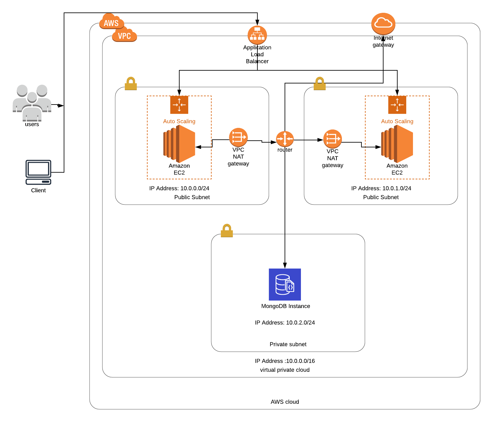

# NodeJs application and MongoDB on AWS

## Prerequisite
1. AWS account
2. AWS cli 
3. Terraform 

## Procedure

1. Sign up for an [AWS account](https://portal.aws.amazon.com/billing/signup#/start).
2. Create an aws user that has admin permision with programatic and console access. 
3. Save the secret and access key. 
4. Download and install [AWS cli](https://aws.amazon.com/cli/).
5. run `aws configure`
6. Input the access and secret key from `3` leave other as default.
7. Download and Install [Terraform](https://www.terraform.io/downloads.html).
8. git clone https://github.com/olufuwatobi/node-express-mongoose-demo-on-aws.git ~/njmdb
9. cd ~/njmdb
10. run `terraform init`
11. run `terraform apply` then `yes`
12. Ater applying successfully, then copy the `loadbalancer-dns` from the console output to your browser. It will take about 2 mins to spin up the instances. 
13. The infrastructure will be deployed to eu-west-2

## Destroying the infrastrucure

run `terraform destroy` then `yes`

## Future improvement

1. Cloudfront Distribution with S3 storage or EFS
2. CI/CD pipeline integragion with Jenkins
3. Setting Scalling policy
4. Secret manager for MongoDB username and password
5. Custom DNS

